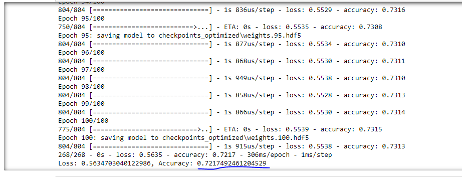

# Neural_Network_Charity_Analysis
## Overview
For this project, we were given a dataset that contains information about applicants who have applied for Alphabet Soup funding. My objective of this project is to determine whether the applicants will be successful if they were to be funded by Alphabet Soup. To do this task, I have used Neural Network’s Deep Learning Model. 
## Results
### Data Preprocessing:
-  From our dataset, the ‘IS_SUCCESSFUL’ column is our target column.
- Every other columns besides the columns that were dropped and not the target column are the features column. They are: ‘APPLICATION_TYPE’, ‘AFFILIATION’, ‘CLASSIFICATION’, ‘USE_CASE’, ‘STATUS’, ‘INCOME_AMT’, ‘SPECIAL_CONSIDERATIONS’, and ‘ASK_AMT’.
- The variables that were neither targets nor features were ‘EIN’, ‘NAME’, and ‘ORGANIZATION’.

### Compiling, Training, and Evaluating the Model:
- For my Deep learning model, I used 80 neurons for my first hidden layer, 50 neurons for my second hidden layer, and 30 neurons for my third hidden layer. Our dataset is evidently very large and thus it is important that we use high amount of neurons per layer and three layers to improve our accuracy of our model.
-   I was not able to meet my target model performance but I attained somewhat close to the target performance; 72.17% accuracy. 

- To improve the model performance, I performed the following: dropping an additional feature ‘ORGANIZATION’, bucketing an additional categorical variable, namely: ‘INCOME_AMT’, I added a third hidden layer with 30 neurons and changed its activation function to ‘linear’. 

### Summary:
The overall results of my model were not satisfactory as I could not reach my target accuracy which is 75%. To improve this model, and also solve the accuracy crisis that I am facing now, I would try to add more neurons for each of the hidden layers, drop the ‘CLASSIFICATION’ column, and perhaps try another activation function for one of my hidden layers. 
